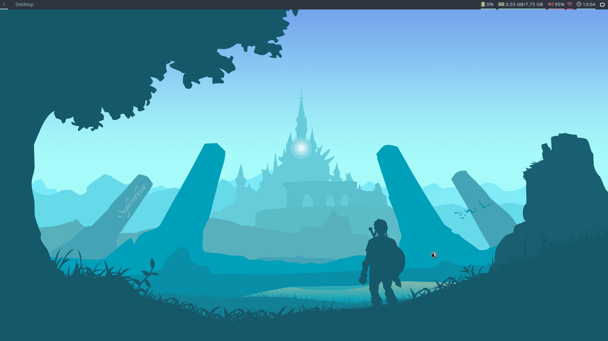
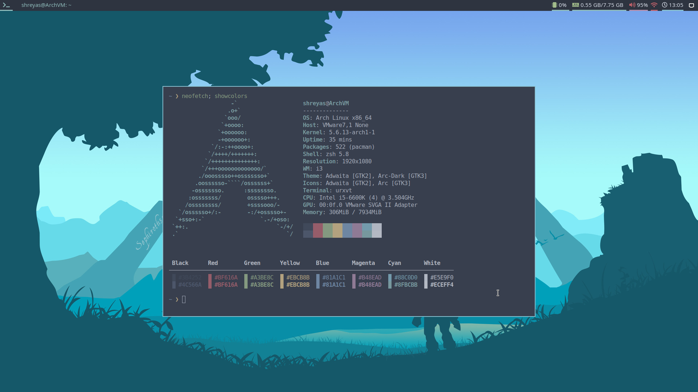
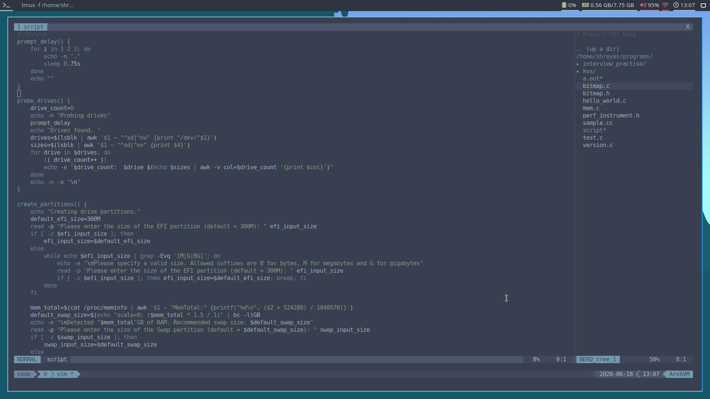

## Dotfiles that I use on my Arch Linux Install (a.k.a the CoronaRice).
I'm using a Nord theme with inspiration drawn from many creative ricers across the web.
Clone the repo into your home directory and use GNU Stow to set up the symlinks correctly.

## You can find some screenshots here:

